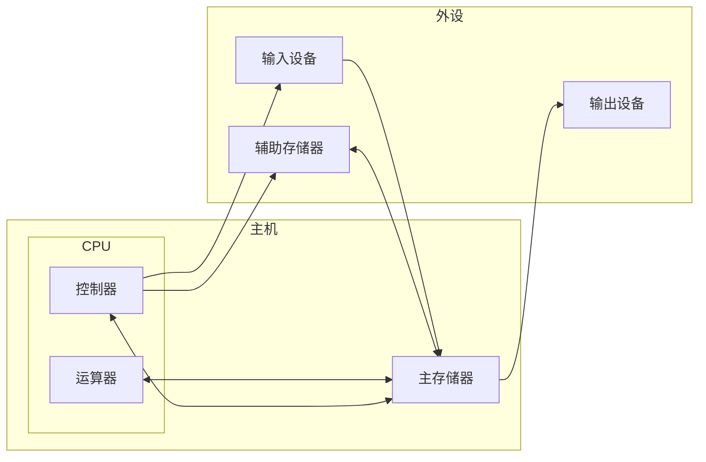
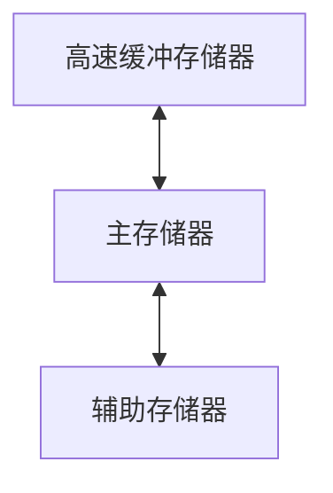
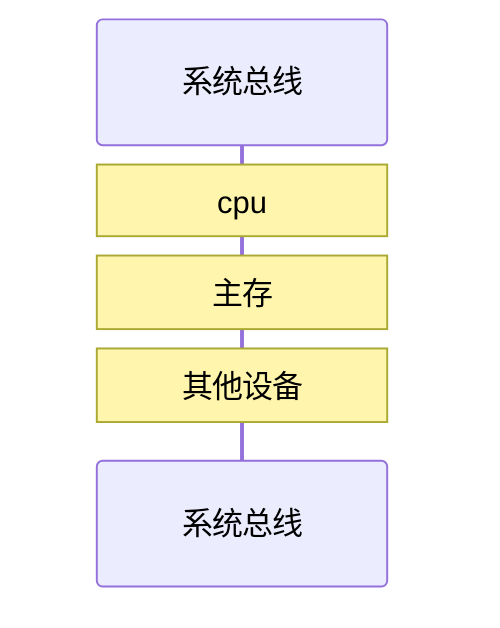

#计算机基础/计算机硬件
## 计算机的组成

```mermaid
graph LR

a[输入设备]
b[主存储器]
c[辅助存储器]
d[输出设备]
e[运算器]
f[控制器]

a --> b
f --> a
b --> d
f --> c

e <--> b
f <--> b
c <--> b

subgraph 主机
	subgraph CPU
		e
		f
	end
	b
end
subgraph 外设
	a
	d
	c
end
```
## 三级存储系统

```mermaid
graph TD

a[高速缓冲存储器]
b[主存储器]
c[辅助存储器]
a <--> b <--> c
```
## 总线结构
### 单总线结构

```mermaid
sequenceDiagram
	note over 系统总线: cpu
	note over 系统总线: 主存
	note over 系统总线: 其他设备
```
### 多总线结构
- 地址总线
- 数据总线
- 控制总线