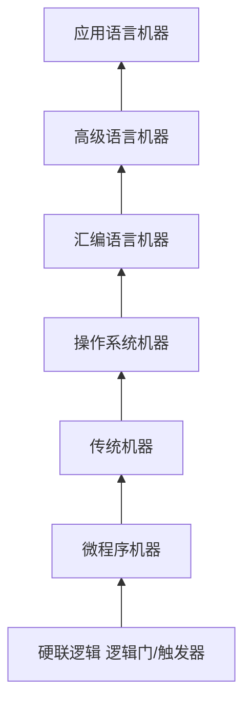
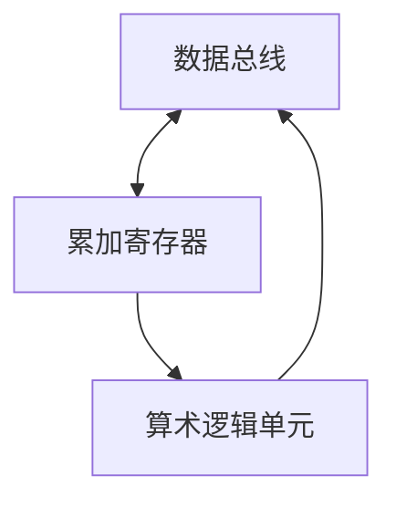

#计算机基础
系统软件：**为有效安全的使用和管理计算机以及为开发和运行应用软件而提供的各种软件**
应用软件：**为数据处理、科学计算、事务管理、多媒体处理、工程设计以及过程控制等应用所编写的各类程序**
## 计算机系统的层级结构

## 程序开发与执行过程

> 计算 a + b - c = ?

|地址|主存|
|:----:|:----:|
|0000|取数 0005|
|0001|加法 0006|
|0002|减法 0007|
|0003|存数 0008|
|0004|停机|
|0005|a|
|0006|b|
|0007|c|
|0008| |

1. 执行 `取数 0005` 命令，将a存入累加寄存器
2. 执行 `加法 0006` 命令，将b与累加寄存器相加，存入累加寄存器
3. 执行 `减法 0007` 命令，将c与累加寄存器相减，存入累加寄存器
4. 执行 `存数 0008` 命令，将累加寄存器的数据存入0008
5. `停机`
